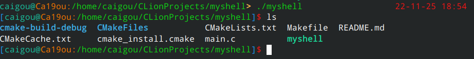
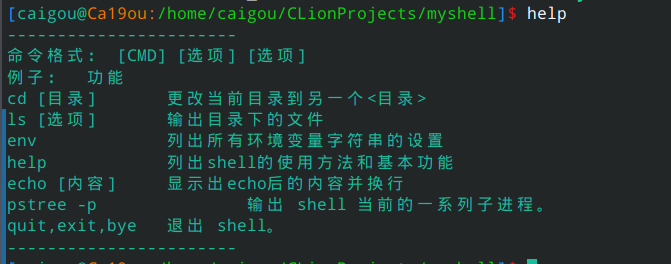

# myshell

简单的shell解释器，作业。<br>
照着CSDN上的一些代码拼凑版本。<br>
首先程序循环运行，不停读取用户输入。<br>
读取输入后，拆分输入字符串为命令和选项。<br>
判断命令是内部方法还是外部方法。<br>
部分内部方法直接执行，通过fork函数创建子进程，执行外部方法。


## Installation:

在项目文件夹下依次输入以下命令，即可进入shell解释器。

```
cmake .
make 
./myshell
```

## Usage：

运行可执行程序`./myshell`，输入help得到命令输入提示。

可以使用ls 、cd等命令。

```
-----------------------
可以输入在环境变量中的命令
命令格式： [CMD] [选项]
例子：          功能
cd [目录]       更改当前目录到另一个<目录>
ls [选项]       输出目录下的文件
env             列出所有环境变量字符串的设置
help            列出shell的使用方法和基本功能
echo [内容]     显示出echo后的内容并换行
process         输出 shell 当前的一系列子进程。
quit,exit,bye   退出 shell。
-----------------------
```






